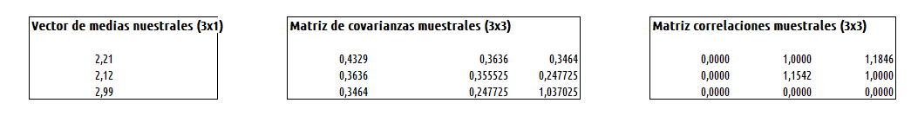
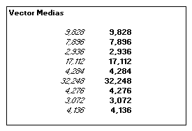
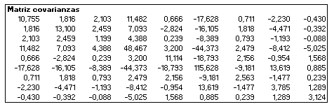
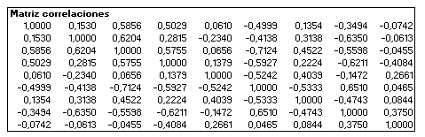
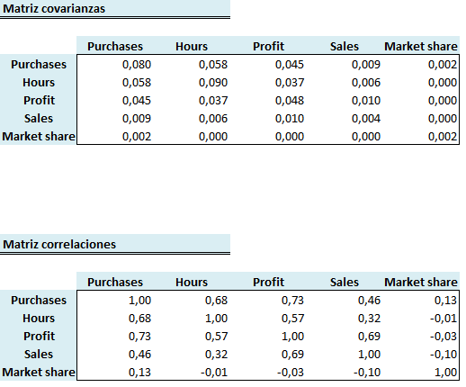
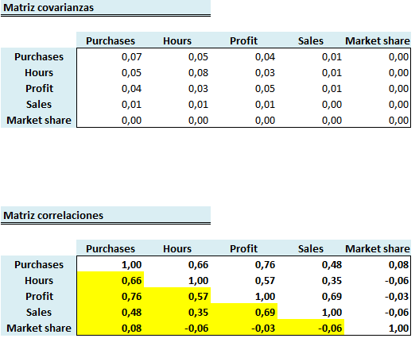
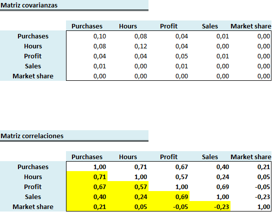

# Practica 1
Momentos Muestrales  
12 de marzo de 2017  


#Introducción

Esta práctica puede descargarse en formato **pdf** en este [**enlace**](../img/notebook_1.pdf).

Los resultados de los ejercicios [1] y [2] pueden descargarse en este [archivo excel1](../practicasADM/img/companies&cluster_valores.xlsx) en el que sólo figuran los resultados y matrices en valor numérico, o en este otro [archivo excel2](../practicasADM/img/companies&cluster.xlsx) que incluye las funciones de Excel y Real-Statistic.

El resultado del ejercicio [3] puede descargarse en este archivo [profit1](../practicasADM/img/profit_valores.xlsx) en el que sólo figuran los resultados y matrices en valor numérico, o en este otro [profit2](../practicasADM/img/profit.xlsx) que incluye las funciones de Excel y Real-Statistic.

La práctica consite en el cálculo de los Estadísticos resumen de una matriz de datos dada, utilizando la herramienta Microsoft EXCEL y Real-Statistic. Se trata de un complemento de EXCEL que extiende sus capacidades de estadísticas estándar, proporcionándole funciones avanzadas y herramientas de análisis de datos, para que pueda realizar más fácilmente una amplia variedad de análisis estadísticos.

Para instalar Real-Statistics hay seguir los siguientes pasos:
  
  * Instalar primero los complementos
    + *Analysis ToolPak*  
    + *Analysis ToolPak - VBA  *
    + *Solver*  
      
  * Volver a la plantilla EXCEL e instalar:
    + *RealStats.xlam* (no instalar desde el escritorio)
  * Al operar con EXCEL, no se deben definir rangos cuyo nombre coincida con el de alguna función. 


<br><br>
Se recomienda cambiar el idioma por defecto de EXCEL a inglés, ya que las funciones de excel de esta práctica están en este idioma. Si se desea ejecutar las funciones en español, en este enlace se encuentra una [Tabla de traducción de fórmulas Excel en español a inglés](http://www.xperimentos.com/2007/03/03/tabla-de-traduccion-de-formulas-excel-en-espanol-a-ingles/).

Para cambiar el idioma hay que seguir los siguientes pasos:

  
  * Seleccionar *Inglés (Estados Unidos)* y establecer por defecto      
  * Elegir idiomas de la Ayuda e Interfaz de usuario y establecer como predeterminado *Inglés (Estados Unidos)*  
  * Si no se localiza el idioma, usar el botón *Agregar*

```

```

#Operaciones Matriciales con EXCEL y Real-Statistic  

Al realizar operaciones con matrices en EXCEL, es necesario seleccionar el rango de la matriz a calcular, introducir la función matricial en la barra de fórmulas, y ejecutar la función utilizando el operador:  
  
```
CONTROL + MAYÚSCULAS + ENTER

```
A continuación, se detallan algunas operaciones matriciales básicas para EXCEL.

* Lectura directa de datos:

```
= {1\2\3;4\5\6;7\8\10}
```

* Asignar un nombre a una matriz o rango:

```
Selecionar rango A1:C3-> Menú Fórmulas/Asignar nombre:matriz.A)
```

* Extraer elementos:

```
= INDEX(matriz.A;ROW(A1);COLUMN(A1))
```

* Extraer bloques:

```
= OFFSET(matriz.A;ROWS(A1:A1);COLUMNS(A1:A1);ROWS(B2:C3);COLUMNS(B2:C3))
```
* Suma de Matrices:

```
= matriz.A + matriz.B 
```
* Multiplicación de matrices:

```
= MMULT(matriz.A;matriz.B)
```

* Multiplicacción por un número:

```
= 2*matriz.A 
```
* Multiplicación punto a punto:

```
= matriz.A*matriz.B 
```
*  División punto a punto:

```
= matriz.B/matriz.A 
```

*  Determinante:

```
= MDETERM(matriz.A)

```

*  Inversa:

```
= MINVERSE(matriz.A) 

```
*  Transpuesta:

```
= TRANSPOSE(matriz.A) 

```

**Operaciones Matriciales con Real-Statistic**


* Extraer bloques:

```
= SUBRANGE(matriz.A;ROWS(A1:B2);COLUMNS(A1:B2);ROWS(B2:C3);COLUMNS(B2:C3))

```
* Combinar bloques:

```
= MERGE(A1:A3;B1:C3) 

```
*  Determinante:

```
= DET(matriz.A) 

```

*  Traza:

```
= TRACE(matriz.A) 

```

#Cálculo de estadísticos resumen  
  
Dada una matriz de datos $X_{n \times p} = (x_{ij})$, los elementos de los estadísticos resumen pueden obtenerse mediante las siguientes formulas:      
  
* __Vector de medias muestrales__ $(\bar{x})$, para cada columna dada,
  
$\bar{x_j} = \frac{1}{n} \sum_{i=1}^{n} x_{ij},\,  j=1,...,p$,

$\bar{x} =\begin{bmatrix} \bar{x_1} \\  \bar{x_2} \\ \vdots \\ \bar{x_3} \end{bmatrix}$


* __Matriz de covarianzas muestrales__ $(S_{p \times p})$ , entre pares de columnas $c_j$ y $c_k$:  

 $S_{ij} = \frac{1}{n}\sum_{i=1}^{n} (x_{ij}-\bar{x_j})(x_{ik}-\bar{x_k}); \ \ \  j,k=1,...,p$
 
 $S =\begin{bmatrix} s_{11} & s_{12} & \dots &  s_{1p} \\ s_{21} & s_{22} & \dots &  s_{2p} \\ \vdots & \vdots & \ddots & \vdots\\ s_{p1} & s_{p2} & \dots &  s_{pp} \end{bmatrix}$
  
* __Matriz de correlaciones muestrales__ $(R_{p \times p})$ , entre pares de columnas $c_j$ y $c_k$:

 $r_{jk} = \frac{s_{jk}}{\sqrt{s_{jj}s_{kk}}}; \ \ \  j,k=1,...,p$

 $S =\begin{bmatrix} 1 & r_{12} & \dots &  r_{1p} \\ r_{21} & 1 & \dots &  r_{2p} \\ \vdots & \vdots & \ddots & \vdots\\ r_{p1} & r_{p2} & \dots &  1 \end{bmatrix}$

#Ejercicio [1]

La matriz de datos de este apartado es 


```
##      V1   V2   V3
## 1  3.60 3.30 4.55
## 2  3.00 2.65 2.80
## 3  2.80 2.85 3.95
## 4  2.05 1.45 4.05
## 5  1.60 1.60 3.90
## 6  1.50 1.75 2.30
## 7  1.95 1.95 1.95
## 8  2.10 2.15 1.60
## 9  1.85 2.00 3.00
## 10 1.65 1.45 1.75
```


En este cuadro se muestran las funciones necesarias para calcular los estadísticos resumen. Para ello hay que nombrar al rango de datos como: *datosn*.

```
= TRANSPOSE(MEANCOL(datosn)): Vector de medias; 

= COVP(datosn): Matriz de covarianzas (1/n): Transparencias;

= COV(datosn): Matriz de covarianzas (1/(n-1));

= CORR(datosn): Matriz de correlaciones;

= IDENTITY(ROWS(datosn)): Matriz identidad de orden FILAS(datosn)

= DIAG(matriz): Vector fila o columna de elementos diagonales de una matriz; 

= DIAG(IDENTITY(ROWS(datosn))): vector de unos de orden ROWS(datan);

= DIAGONAL(vector): matriz diagonal con elementos dados por las coordenadas de un vector. 

```
***

Los resultados obtenidos son,





#Ejercicio[2]

La matriz de datos de este apartado es 


```
##           Country RedMeat WhiteMeat Eggs Milk Fish Cereals Starch Nuts
## 1         Albania    10.1       1.4  0.5  8.9  0.2    42.3    0.6  5.5
## 2         Austria     8.9      14.0  4.3 19.9  2.1    28.0    3.6  1.3
## 3         Belgium    13.5       9.3  4.1 17.5  4.5    26.6    5.7  2.1
## 4        Bulgaria     7.8       6.0  1.6  8.3  1.2    56.7    1.1  3.7
## 5  Czechoslovakia     9.7      11.4  2.8 12.5  2.0    34.3    5.0  1.1
## 6         Denmark    10.6      10.8  3.7 25.0  9.9    21.9    4.8  0.7
## 7        EGermany     8.4      11.6  3.7 11.1  5.4    24.6    6.5  0.8
## 8         Finland     9.5       4.9  2.7 33.7  5.8    26.3    5.1  1.0
## 9          France    18.0       9.9  3.3 19.5  5.7    28.1    4.8  2.4
## 10         Greece    10.2       3.0  2.8 17.6  5.9    41.7    2.2  7.8
## 11        Hungary     5.3      12.4  2.9  9.7  0.3    40.1    4.0  5.4
## 12        Ireland    13.9      10.0  4.7 25.8  2.2    24.0    6.2  1.6
## 13          Italy     9.0       5.1  2.9 13.7  3.4    36.8    2.1  4.3
## 14    Netherlands     9.5      13.6  3.6 23.4  2.5    22.4    4.2  1.8
## 15         Norway     9.4       4.7  2.7 23.3  9.7    23.0    4.6  1.6
## 16         Poland     6.9      10.2  2.7 19.3  3.0    36.1    5.9  2.0
## 17       Portugal     6.2       3.7  1.1  4.9 14.2    27.0    5.9  4.7
## 18        Romania     6.2       6.3  1.5 11.1  1.0    49.6    3.1  5.3
## 19          Spain     7.1       3.4  3.1  8.6  7.0    29.2    5.7  5.9
## 20         Sweden     9.9       7.8  3.5 24.7  7.5    19.5    3.7  1.4
## 21    Switzerland    13.1      10.1  3.1 23.8  2.3    25.6    2.8  2.4
## 22             UK    17.4       5.7  4.7 20.6  4.3    24.3    4.7  3.4
## 23           USSR     9.3       4.6  2.1 16.6  3.0    43.6    6.4  3.4
## 24       WGermany    11.4      12.5  4.1 18.8  3.4    18.6    5.2  1.5
## 25     Yugoslavia     4.4       5.0  1.2  9.5  0.6    55.9    3.0  5.7
##    Fr.Veg
## 1     1.7
## 2     4.3
## 3     4.0
## 4     4.2
## 5     4.0
## 6     2.4
## 7     3.6
## 8     1.4
## 9     6.5
## 10    6.5
## 11    4.2
## 12    2.9
## 13    6.7
## 14    3.7
## 15    2.7
## 16    6.6
## 17    7.9
## 18    2.8
## 19    7.2
## 20    2.0
## 21    4.9
## 22    3.3
## 23    2.9
## 24    3.8
## 25    3.2
```

***
En este ejercicio las operaciones son idénticas al apartado anterior y los resultados obtenidos son,

***

Los resultados obtenidos son,








#Ejercicio[3]

Este ejercicio contine datos relativos a operaciones comerciales de una cadena de comida rápida, en el que se añade una variable dicotómica que informa sobre la aplicación de una promoción. *Special.offer*.  

Los datos se separaran en dos pestañas nuevas pestañas de excel data 0 (rojos) y data 1 (azules) para indicar si aplican o no la oferta.  

La pregunta es si se puede confirmar con los numeros lo que parece reflejarse en los gráficos. 


Los resultados obtenidos son,

* **Datos conjuntos**  



* **Sin oferta**  



* **Con oferta**  



* **Gráfico conjunto**  


##Conclusiones

* Las matrices de correlaciones son coherentes con el gráfico. 

* las variables tienen correlación positiva, excepto Market.Share (incorrelada).  

* Tanto si hay oferta especial (azules) como si no (rojos) no parece que el sistema se altere demasiado. 

<br><br>


